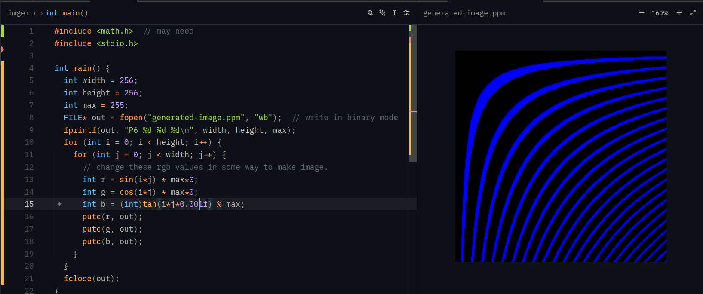
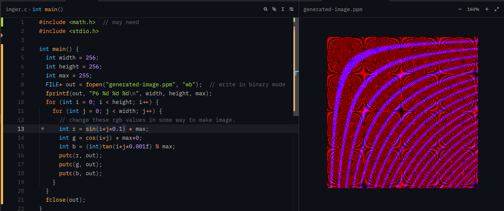
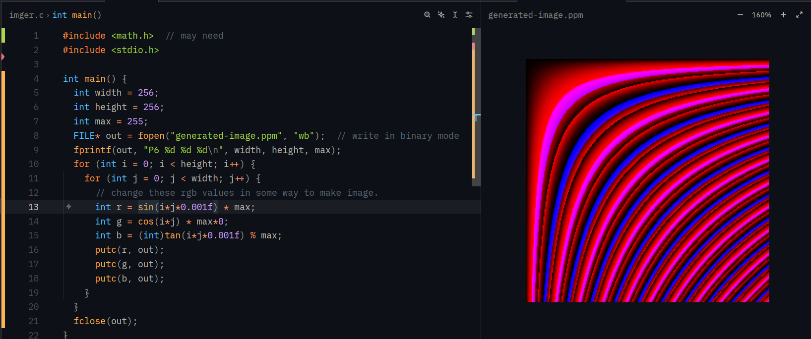

# imger
make image via code

### Compile
  ```
  gcc main.c -o imger -lm
  ```
  note
  - make sure you have gcc installed.
  - if not using math.h you can remove -lm flag.
  
### Run
  ```
  ./imger 
  ``` 
  note
  - The generated image will be saved at root directory as "generated-image.ppm".
  - ppm image format is not supported by all image viewers. So download an image viewer that supports ppm or vscode ppm viewer extension or convert the image to another format.

### Screenshots

- 
- 
- 
- 
- 
- 
- 
- 
- 
- 

